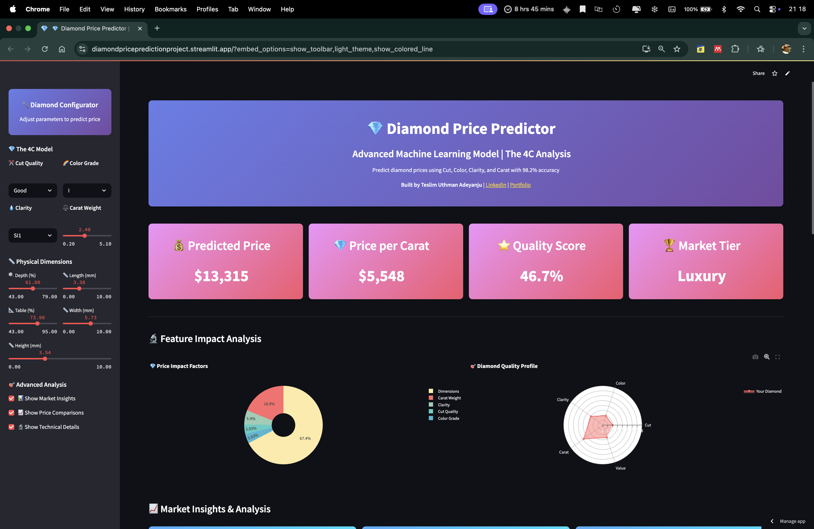
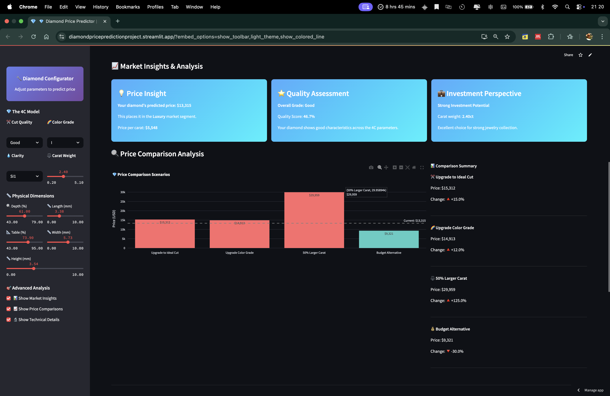

# 💎 Diamond Price Prediction ML

[](https://www.python.org/downloads/)
[](https://streamlit.io/)
[](https://scikit-learn.org/)
[](https://opensource.org/licenses/MIT)

> **Machine learning model that predicts diamond prices using the 4C criteria (Cut, Color, Clarity, Carat) with 98.2% accuracy.**

## Overview

End-to-end ML pipeline predicting diamond prices from 53,940 samples. Features advanced preprocessing, XGBoost modeling, and interactive Streamlit deployment.

## 🚀 Live Demo

### App Preview
<details>
<summary>📸 View Screenshots</summary>

<br>





</details>

## Performance

| Model | R² Score | RMSE | MAE |
|-------|----------|------|-----|
| **XGBoost** | 0.982 | $486 | $298 |
| Random Forest | 0.978 | $542 | $321 |
| Gradient Boosting | 0.975 | $578 | $334 |

## Tech Stack

**ML**: scikit-learn, XGBoost, pandas, numpy  
**Visualization**: matplotlib, seaborn, plotly  
**Deployment**: Streamlit  
**Analysis**: Jupyter Notebook

## Quick Start

```bash
# Clone repository
git clone https://github.com/TeslimAdeyanju/diamond-price-prediction-ml.git
cd diamond-price-prediction-ml

# Install dependencies
pip install -r requirements.txt

# Run Streamlit app
streamlit run diamond-price-prediction/app.py
```

## Project Structure

```
├── diamond-price-prediction/
│   ├── Diamond_price_prediction_note.ipynb  # ML analysis
│   ├── app.py                               # Streamlit app
│   └── requirements.txt                     # Dependencies
├── Data/data.csv                            # Dataset
├── Model files/                             # Trained models
└── screenshots/                             # App previews
```

## Key Features

- **Feature Engineering**: PCA, polynomial features, categorical encoding
- **Model Comparison**: Multiple algorithms tested and optimized
- **Interactive App**: Real-time predictions with visualizations
- **Production Ready**: Robust error handling and model persistence

## Results

- **98.2% accuracy** on diamond price prediction
- **Carat weight** is strongest predictor (r=0.92)
- **Premium/Ideal cuts** command highest prices
- **Advanced preprocessing** improves model performance significantly

## Author

**Teslim Uthman Adeyanju**  
*Data Scientist & ML Engineer*

📧 [info@adeyanjuteslim.co.uk](mailto:info@adeyanjuteslim.co.uk) | 🔗 [LinkedIn](https://www.linkedin.com/in/adeyanjuteslimuthman) | 🌐 [Portfolio](https://adeyanjuteslim.co.uk)

---

⭐ **Star this repo if you found it helpful!**
